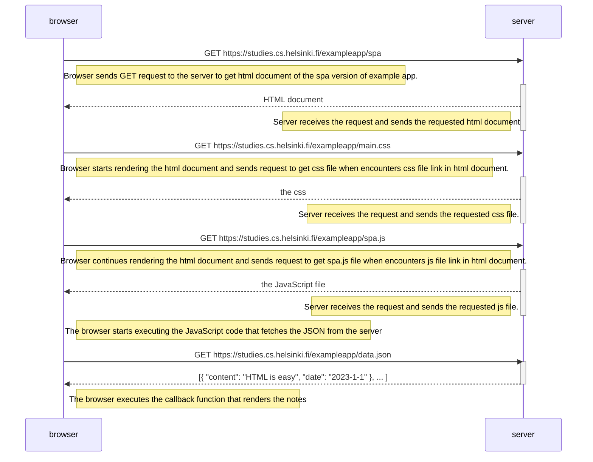

```mermaid
sequenceDiagram
    participant browser
    participant server
    
    browser->>server: GET https://studies.cs.helsinki.fi/exampleapp/spa
    note right of browser: Browser sends GET request to the server to get html document of the spa version of example app.
    activate server
    server-->>browser: HTML document
    note left of server: Server receives the request and sends the requested html document
    deactivate server

    browser->>server: GET https://studies.cs.helsinki.fi/exampleapp/main.css
    note right of browser: Browser starts rendering the html document and sends request to get css file when encounters css file link in html document.
    activate server
    server-->>browser: the css 
    note left of server: Server receives the request and sends the requested css file.
    deactivate server

    browser->>server: GET https://studies.cs.helsinki.fi/exampleapp/spa.js
    note right of browser: Browser continues rendering the html document and sends request to get spa.js file when encounters js file link in html document.
    activate server
    server-->>browser: the JavaScript file
    note left of server: Server receives the request and sends the requested js file.
    deactivate server

    Note right of browser: The browser starts executing the JavaScript code that fetches the JSON from the server

    browser->>server: GET https://studies.cs.helsinki.fi/exampleapp/data.json
    activate server
    server-->>browser: [{ "content": "HTML is easy", "date": "2023-1-1" }, ... ]
    deactivate server

    Note right of browser: The browser executes the callback function that renders the notes
```