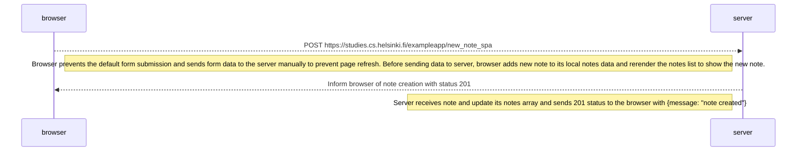

```mermaid
sequenceDiagram

    participant browser
    participant server

    browser-->>server: POST https://studies.cs.helsinki.fi/exampleapp/new_note_spa    
    note right of browser: Browser prevents the default form submission and sends form data to the server manually to prevent page refresh. Before sending data to server, browser adds new note to its local notes data and rerender the notes list to show the new note.    
	
    server-->>browser: Inform browser of note creation with status 201   
	note left of server: Server receives note and update its notes array and sends 201 status to the browser with {message: "note created"}
    
```